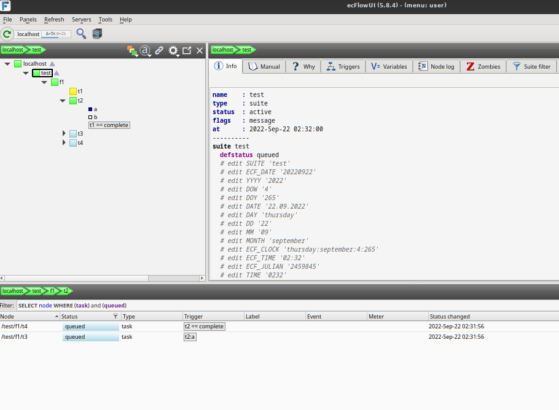
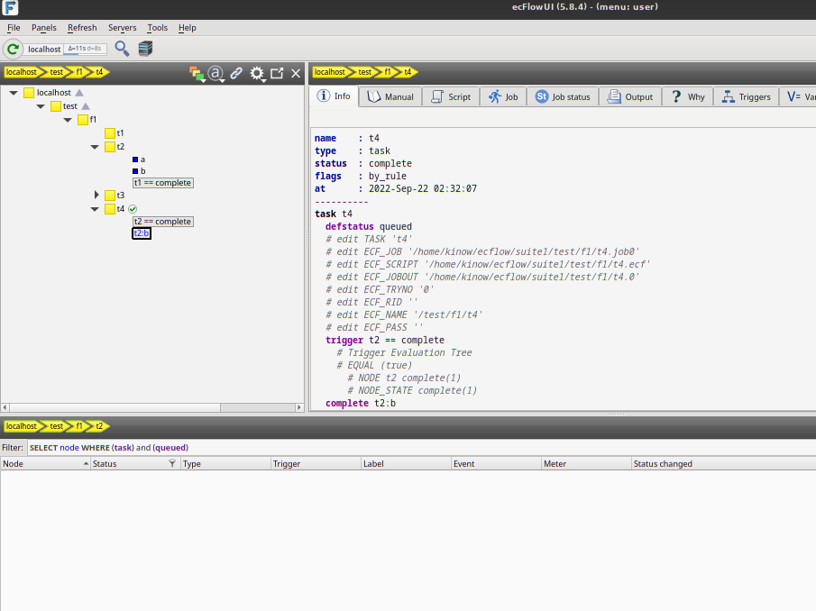
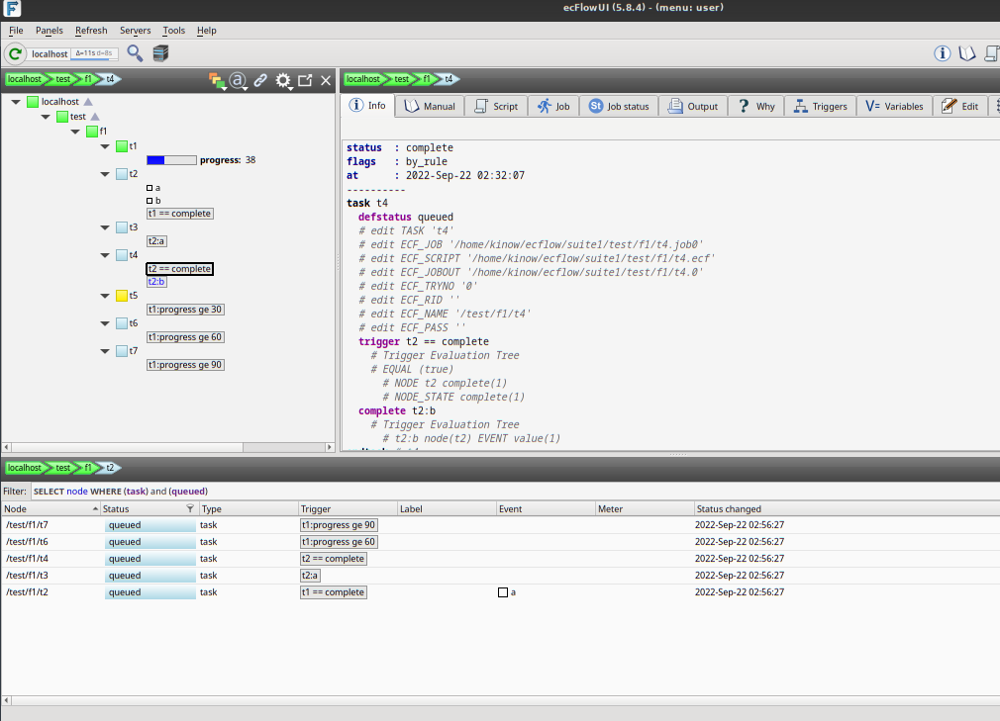
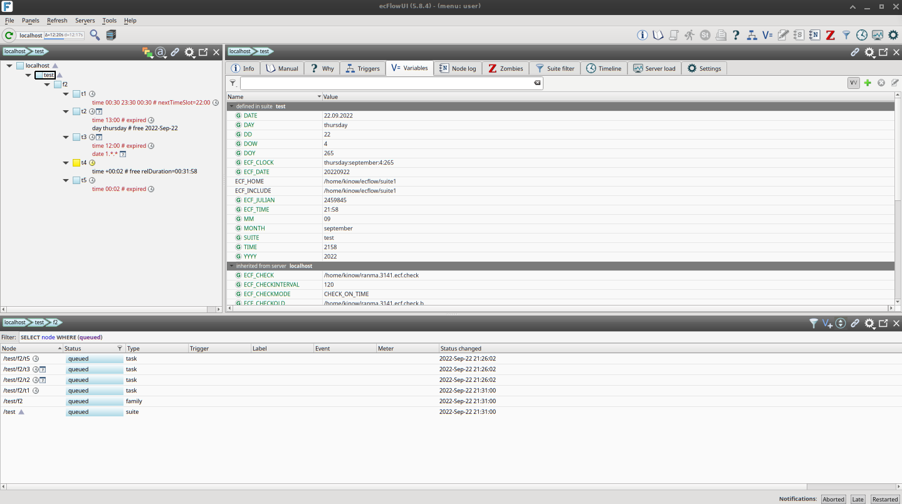
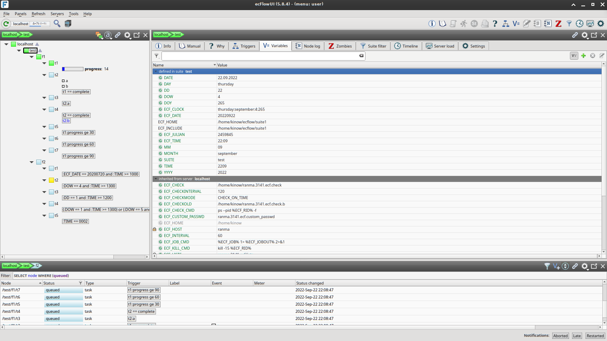
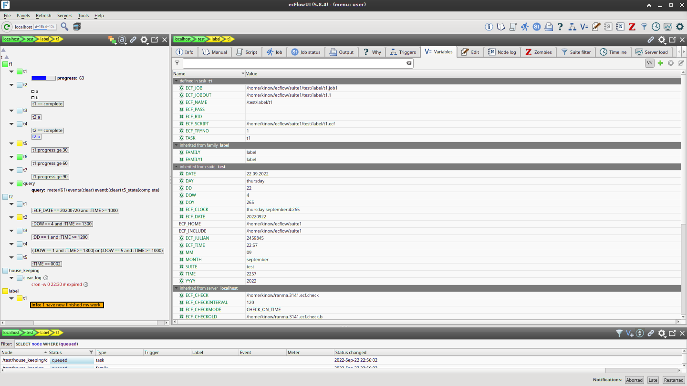
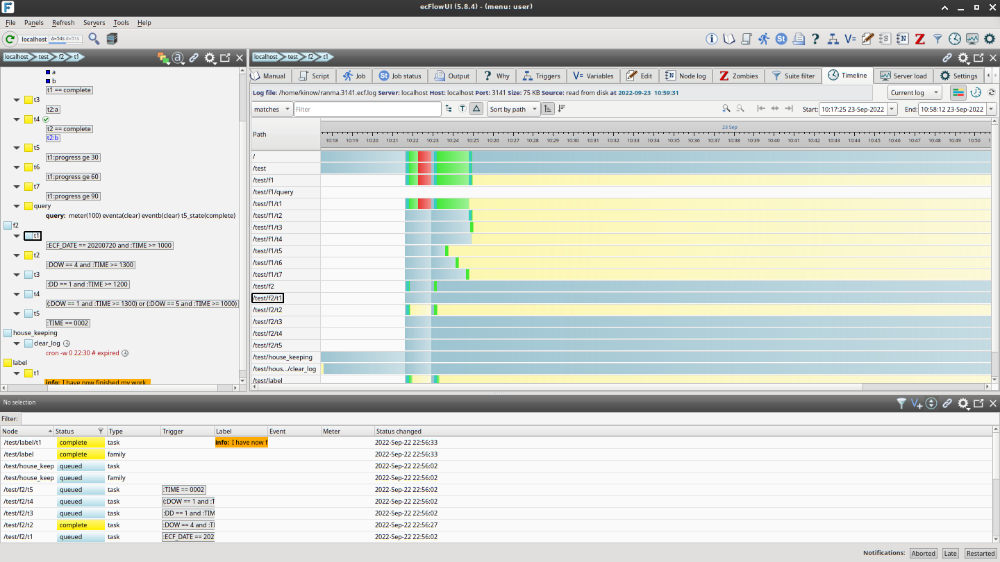

# suite1

An example suite created following the [ecFlow Tutorial](https://confluence.ecmwf.int/display/ECFLOW/Tutorial).
The version of ecFlow used was 5.8.4, and it was installed via `conda` on a Ubuntu Linux 22.04 LTS.

The examples were created following the tutorial up to section Advanced Topics / Limit Families.
In the tutorial, the suite is altered to have just one family `f1`, or `f2`, or `f3`, etc.
Here, instead, I maintained the old families to visualize everything in the `ecflow_ui`.

After the Limit Features section, the examples get a little more complicated to follow using the
`test` suite (archived here). But the rest can easily be followed with a toy suite or by just
reading the text.

## Screenshots

